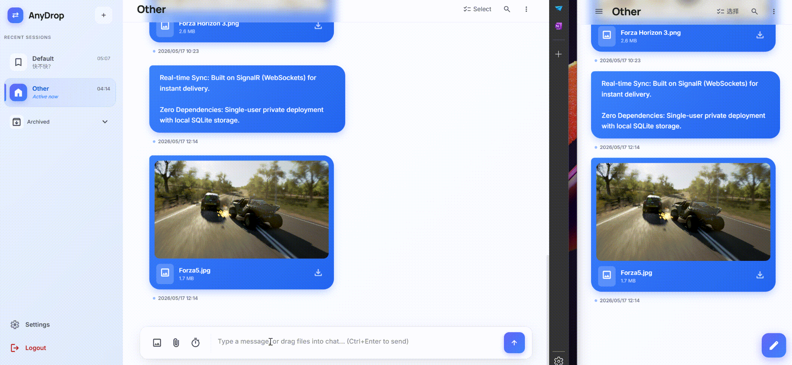

# AnyDrop

[中文](/README.md) | [English](/docs/README_en.md)

> 私有、自托管的跨设备内容共享应用，基于 .NET 10 + Blazor 构建。

通过浏览器即可在任意设备间安全地保存与获取文字、图片、文件和链接，实时同步，无需依赖任何第三方云服务。

---

## 功能特点

- **跨设备实时同步** — 基于 SignalR（WebSocket），消息推送即时到达所有已登录设备
- **多类型内容** — 支持文字、图片、视频、任意文件、链接（含 OG 元数据预览）
- **主题分组** — 将内容按主题（频道）组织，支持置顶、归档、删除
- **主题搜索** — 全文搜索、按日期查找、按类型（图片/视频/文件/链接）分类浏览
- **阅后即焚** — 消息可设为"阅后即焚"，阅读后自动销毁
- **单用户私有部署** — 首次访问完成初始化设置，密码保存在本地数据库，不外发
- **容器化就绪** — 提供 Dockerfile 与 docker-compose.yml，一命令启动

---



---

## 技术栈

| 层 | 技术 |
|---|---|
| 框架 | .NET 10 · Blazor Web App（Interactive Server） |
| 数据库 | SQLite（EF Core） |
| 实时通信 | ASP.NET Core SignalR |
| 样式 | Tailwind CSS v4 |
| 认证 | JWT Bearer + Cookie |
| 容器 | Docker / Docker Compose |

---

## 快速开始

### 服务端

### 方式一：Docker Compose（推荐）

**1. 克隆仓库**

```bash
git clone https://github.com/KOPElan/anydrop.git
cd anydrop
```

**2. 创建环境变量文件**

```bash
cp .env.example .env
```

然后生成一个随机密钥填入 `ANYDROP_JWT_SECRET`（**必填，至少 32 个字符**）：

```bash
openssl rand -hex 32
# 或
pwsh -Command "[guid]::NewGuid().ToString('N') + [guid]::NewGuid().ToString('N')"
```

`.env` 文件内容示例：

```dotenv
# 必填：JWT 签名密钥（至少 32 字符）
ANYDROP_JWT_SECRET=your-very-long-random-secret-key

# 可选：上传文件大小上限（字节），默认 100 MB
ANYDROP_MAX_FILE_SIZE=104857600

# 可选：登录令牌有效期（小时），默认 24 小时
ANYDROP_TOKEN_EXPIRY_HOURS=24
```

> 未提供 `ANYDROP_JWT_SECRET` 时 `docker compose` 会直接报错退出；服务端在启动时也会因密钥缺失或短于 32 字符而失败。这是刻意设计的：宁可启动失败，也不要带着空密钥或公开的默认密钥运行。

**3. 启动服务**

```bash
docker compose up -d
```

服务端镜像会从 GHCR 拉取（`ghcr.io/kopelan/anydrop`）。也可以不克隆源码，直接用镜像启动：

```bash
docker run -d --name anydrop \
  -p 8080:8080 \
  -e Auth__JwtSecret="<至少 32 字符的随机密钥>" \
  -v anydrop-data:/data \
  ghcr.io/kopelan/anydrop:latest
```

### 版本固定与回滚

默认跟随 `latest`。要固定版本（推荐用于长期运行），在 `.env` 中指定版本号：

```dotenv
ANYDROP_VERSION=v1.2.3
```

```bash
docker compose pull
docker compose up -d --no-build
```

回滚只需把 `ANYDROP_VERSION` 改回上一个版本，再执行同样两条命令。

### 从源码更新

```bash
git pull
docker compose down
docker compose up -d --build
```

**4. 初始化账号**

首次启动后，在浏览器访问 `http://localhost:8080/setup`，设置登录密码。

> 数据（SQLite 数据库 + 上传文件）持久化到 Docker volume `anydrop-data`，容器重启不会丢失。

---

### 方式二：本地源码运行

#### 前置要求

- [.NET 10 SDK](https://dotnet.microsoft.com/download)
- [Node.js ≥ 20](https://nodejs.org/)（用于 Tailwind CSS 编译）

#### 步骤

```bash
# 1. 克隆仓库
git clone https://github.com/KOPElan/anydrop.git
cd anydrop

# 2. 安装前端依赖（Tailwind CSS）
npm install

# 3. 配置 JWT 密钥（必填，至少 32 字符）
#    使用 .NET User Secrets，密钥不会写入版本库
dotnet user-secrets set "Auth:JwtSecret" "your-very-long-random-secret-key" --project AnyDrop

# 4. 启动应用
dotnet run --project AnyDrop
```

> 缺少密钥时应用会在启动阶段直接抛出 `Auth:JwtSecret is required ...` 并退出，不会以空密钥运行。

应用默认监听 `http://localhost:5002`。

首次运行请访问 `http://localhost:5002/setup` 完成初始化。

---

## 目录结构（详解）

- **AnyDrop/**: 服务端主项目，包含 Minimal API、SignalR Hub、EF Core 上下文与前端静态资源。
  - **Api/**: Minimal API 扩展方法与请求 DTO（按资源分文件组织，路由前缀 `/api/v1/`）。
  - **Components/**: Blazor 组件与页面（Interactive Server 模式）。Razor 组件应尽量使用 code-behind `.razor.cs` 分离复杂逻辑。
  - **Data/**: 包含 `AnyDropDbContext.cs` 与数据库迁移文件（SQLite）。
  - **Hubs/**: SignalR Hub（`ShareHub`）用于实时推送消息到已连接的客户端。
  - **Services/**: 核心业务实现（接口 + 实现），禁止直接依赖 Razor 组件。
  - **wwwroot/**: Tailwind 编译后样式、JS 及其它静态资源。

- **AnyDrop.App/**: 跨平台移动/桌面客户端（MAUI 外壳）。
  - 目标框架为 `net10.0-android` / `net10.0-ios` / `net10.0-maccatalyst` / `net10.0-windows10.0.19041.0`；平台代码放在 `Platforms/`，UI 放在 `Components/`。
  - 平台适配实现（`Preferences`、`SecureStorage`、`FilePicker`、通知、网络状态）保留在本项目，因为只有它才具备按目标框架生效的条件编译。

- **AnyDrop.App.Core/**: 客户端平台无关核心库（`net10.0`），被 `AnyDrop.App` 与 `AnyDrop.Tests.Unit` 共同引用。
  - 包含 `Models/`、`Infrastructure/`、`Services/`，以及 `Platform/` 下的平台原语抽象（`IPreferenceStore`、`ISecretStore`）。
  - 之所以单独拆分：`AnyDrop.App` 只面向平台目标框架，无法被 `net10.0` 的测试项目引用，曾导致客户端单元测试完全无法运行。

- **AnyDrop.Shared/**: 跨项目共享 DTO 与类型定义。

- **Tests.Unit/** 与 **Tests.E2E/**: 单元与端到端测试代码。

---

## 服务端简介

- **框架与角色**: 服务端为 `AnyDrop` 项目，基于 .NET 10、Minimal API 与 Kestrel。API 路由以 `/api/v1/` 命名空间暴露，认证采用 JWT + Cookie 混合方案。
- **持久化**: 使用 SQLite（文件存储），默认数据目录为 `data/`，包含数据库文件与上传的文件目录。
- **实时同步**: 通过 SignalR Hub（`Hubs/ShareHub.cs`）实现消息广播与客户端订阅。Hub 只负责转发与鉴权，业务逻辑放在 `Services/` 中处理。
- **配置**: 推荐通过环境变量或 `dotnet user-secrets` 设置敏感配置（如 `Auth__JwtSecret`）。容器部署时通过 `.env` 或容器环境变量注入。

## 移动端（MAUI）简介

- **项目**: `AnyDrop.App` 为 MAUI 应用，支持 Android、iOS、Windows 等（按平台包含在 `Platforms/`）。
- **目的**: 提供原生体验的接入端，可在移动端快速浏览、上传与接收任意类型内容，并通过 SignalR 保持实时连接。
- **开发**: 在本机开发时，可在 IDE（Visual Studio）中启动 `AnyDrop.App`，或使用 `dotnet build` / `dotnet run` 针对特定平台进行调试。移动端通过配置的 API 地址与服务端通信，开发时请确保服务端可访问（`ASPNETCORE_URLS` 设置为可被设备/模拟器访问的地址）。

---

## Tailwind 开发监听

项目包含两个 Tailwind 输入源：

- 服务端（Blazor）: `AnyDrop/wwwroot/app.css` → 输出 `AnyDrop/wwwroot/tailwind.css`。
- 移动端/静态（MAUI/SPA）: `AnyDrop.App/wwwroot/css/input.css` → 输出 `AnyDrop.App/wwwroot/css/tailwind.css`。

分别构建或监听方式如下：

```bash
# 服务端：构建 / 监听
npm run css:build:server
npm run css:watch:server

# 移动端：构建 / 监听
npm run css:build:app
npm run css:watch:app
```

---

## 环境变量参考

| 变量名 | 说明 | 默认值 |
|---|---|---|
| `Auth__JwtSecret` | JWT 签名密钥（**必填**） | — |
| `Auth__TokenExpiryHours` | 登录令牌有效期（小时） | `24` |
| `Auth__LoginMaxFailures` | 登录失败锁定阈值 | `5` |
| `Auth__LoginCooldownSeconds` | 登录冷却时间（秒） | `60` |
| `Storage__DatabasePath` | SQLite 数据库路径 | `data/anydrop.db` |
| `Storage__BasePath` | 上传文件存储目录 | `data/files` |
| `Storage__MaxFileSizeBytes` | 单文件大小上限（字节） | Docker Compose 为 `104857600`（100 MB）；源码运行时见 `AnyDrop/appsettings.json` |
| `Storage__OrphanCleanupEnabled` | 是否实际回收孤儿文件（`false` 时只报告） | `false` |
| `ASPNETCORE_URLS` | Kestrel 监听地址 | `http://+:5002`（容器内为 `http://+:8080`） |

---

## 存储维护

上传采用**先写临时文件再原子改名**的方式：进程崩溃或被 kill 时，不会在最终位置留下长度不完整的半截文件。写入前还会检查存储卷剩余空间，不足时返回 `507`，而不是写到一半失败——磁盘写满会让 SQLite 写入一并失败，导致整个实例不可用。

此外，服务每天会做一次**存储目录与数据库的双向对账**：

- 磁盘上存在、但没有任何消息引用的文件（孤儿文件，通常是历史遗留）
- 数据库引用、但磁盘上已不存在的文件（例如卷未挂载或被部分恢复）

**默认只写日志、不删除任何文件**（`Storage:OrphanCleanupEnabled=false`）。这是刻意选择的：本项目的卖点是数据完全由你掌握，静默删除文件的代价高于回收一点磁盘空间。请先查看日志中的报告：

```
孤儿文件对账完成：扫描 812 个文件；孤儿 3 个（5242880 字节），已删除 0 个；
数据库引用了 0 个不存在的文件。模式：仅报告（Storage:OrphanCleanupEnabled=false）。
样本：20260418/ab12….png, 20260418/cd34….jpg
```

确认这些文件确实无用后，把 `Storage__OrphanCleanupEnabled` 设为 `true` 即可自动回收。对账有 24 小时宽限期，正在进行中的上传不会被误判。

---

## 健康检查

`GET /health` 为匿名可访问的探针，会真实执行两项检查后返回 JSON：

- `database`：查询一次数据库，可发现库文件损坏或表结构缺失
- `storage`：在 `Storage:BasePath` 下写入并删除一个临时文件，可发现卷写满或目录不可写

```bash
curl -fsS http://localhost:8080/health
# {"status":"healthy","checks":{"database":"ok","storage":"ok"}}
```

任一检查失败时返回 `503`。`docker-compose.yml` 的 healthcheck 已改用该端点——
此前它只请求首页，而首页返回 200 仅说明进程起来了，数据库损坏或磁盘写满时依然会被判定为健康。

---

## 数据备份与恢复

持久化数据存放在 Docker volume `anydrop-data`（挂载到容器的 `/data`），包含：

- `/data/anydrop.db` — SQLite 数据库（用户、主题、消息元数据）
- `/data/anydrop.db-wal`、`/data/anydrop.db-shm` — SQLite 预写日志（数据库运行在 WAL 模式）
- `/data/files/` — 上传的文件

> ⚠️ **不要在服务运行时直接 `tar` 整个数据目录。** 数据库处于 WAL 模式，逐个复制文件可能得到
> 不一致甚至损坏的备份——`.db` 与 `-wal` 的内容可能来自不同时刻。请使用下面两种方式之一。

### 方式一：短暂停机备份（推荐，最可靠）

```bash
docker compose stop anydrop
docker run --rm \
  -v anydrop-data:/data \
  -v "$(pwd)/backup:/backup" \
  alpine tar czf /backup/anydrop-backup-$(date +%Y%m%d-%H%M%S).tar.gz -C /data .
docker compose start anydrop
```

### 方式二：在线备份（服务不中断）

使用 SQLite 自带的 `.backup` 命令导出快照，它保证读取到一个一致的事务视图：

```bash
mkdir -p backup
docker run --rm \
  -v anydrop-data:/data \
  -v "$(pwd)/backup:/backup" \
  alpine sh -c 'apk add --no-cache sqlite >/dev/null &&
    sqlite3 /data/anydrop.db ".backup /backup/anydrop.db" &&
    tar czf /backup/anydrop-files-$(date +%Y%m%d-%H%M%S).tar.gz -C /data files'
```

> 注意这里以**读写**方式挂载卷（没有 `:ro`）：WAL 模式下即使只读查询也需要访问 `-shm` 文件。

### 恢复

```bash
docker compose down
# 方式一产物（整目录归档）
docker run --rm -v anydrop-data:/data -v "$(pwd)/backup:/backup" alpine \
  sh -c 'rm -rf /data/* && tar xzf /backup/<备份文件>.tar.gz -C /data'
docker compose up -d
```

恢复完成后访问 `/health` 确认数据库与存储均正常。

---

## 开发指南

### 运行测试

```bash
# 单元测试（覆盖服务端 + 客户端核心库 AnyDrop.App.Core）
dotnet test AnyDrop.Tests.Unit

# E2E 测试（Playwright 驱动真实浏览器）
dotnet build AnyDrop.Tests.E2E
# 首次需要安装浏览器；只跑无头模式时装 chromium-headless-shell 即可（体积约为完整 chromium 的一半）
pwsh AnyDrop.Tests.E2E/bin/Debug/net10.0/playwright.ps1 install chromium-headless-shell
dotnet test AnyDrop.Tests.E2E
```

E2E 会自行以**独立的临时数据目录**启动服务端，不会触碰本地的 `AnyDrop/Data`。若用例失败，服务端日志会写入 `TestResults/e2e-app-logs/`，CI 也会把它作为产物上传。

> CI（`.github/workflows/ci.yml`）在每次 push / PR 时执行：服务端与客户端核心库编译、全部单元测试、**Playwright E2E**、MAUI 客户端（Android）编译，以及 Docker 镜像构建。

### 数据库迁移

```bash
# 添加新迁移
dotnet ef migrations add <MigrationName> --project AnyDrop

# 应用迁移
dotnet ef database update --project AnyDrop
```

### 构建容器镜像

```bash
docker build -f AnyDrop/Dockerfile -t anydrop .
docker run -p 8080:8080 -e Auth__JwtSecret=your-secret anydrop
```

发布：推送 `v*.*.*` 形式的标签即可由 [Release 工作流](.github/workflows/release.yml) 自动构建并推送镜像到 GHCR，同时生成 `1.2.3`、`1.2`、`1` 与 `latest` 四种标签。该工作流也支持手动触发，此时只构建、不推送，用于在不发布的前提下验证构建可用。

---

## License

[GPL-3.0](LICENSE)
