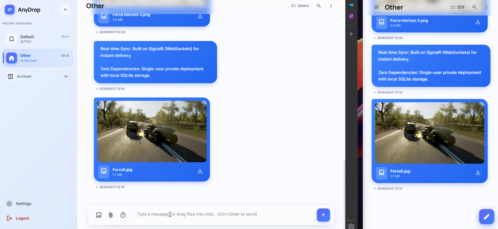

# AnyDrop

[中文](/README.md) | [English](/docs/README_en.md)

> A private, self-hosted cross-device content sharing app built with .NET 10 + Blazor.

Use a browser to securely save and retrieve text, images, files, and links across any device. Everything stays in your own deployment, with no third-party cloud dependency.

---

## Features

- **Real-time cross-device sync** — Built on SignalR (WebSocket) so messages reach all signed-in devices immediately
- **Multiple content types** — Supports text, images, videos, arbitrary files, links, and OG metadata previews
- **Topic-based organization** — Organize content by topic (channel) with pinning, archiving, and deletion
- **Topic search** — Full-text search, date-based filtering, and type-based browsing for images, videos, files, and links
- **Read-and-destroy** — Items can be marked as “read-and-destroy”; once opened, they are removed automatically
- **Single-user private deployment** — First visit runs the initial setup flow; the password is stored locally in the database and never sent out
- **Container-ready** — Includes a Dockerfile and docker-compose.yml for one-command startup

---



---

## Tech Stack

| Layer | Technology |
|---|---|
| Framework | .NET 10 · Blazor Web App (Interactive Server) |
| Database | SQLite (EF Core) |
| Real-time communication | ASP.NET Core SignalR |
| Styling | Tailwind CSS v4 |
| Authentication | JWT Bearer + Cookie |
| Container | Docker / Docker Compose |

---

## Quick Start

### Server

### Option 1: Docker Compose (recommended)

**1. Clone the repository**

```bash
git clone https://github.com/KOPElan/anydrop.git
cd anydrop
```

**2. Create an environment variable file**

```bash
cp .env.example .env   # create it manually if it does not exist
```

Example `.env` file:

```dotenv
# Required: JWT signing secret (recommend a random string with at least 32 characters)
ANYDROP_JWT_SECRET=your-very-long-random-secret-key

# Optional: maximum upload size in bytes, default 100 MB
ANYDROP_MAX_FILE_SIZE=104857600

# Optional: token expiration in hours, default 24 hours
ANYDROP_TOKEN_EXPIRY_HOURS=24
```

**3. Start the services**

```bash
docker compose up -d
```

**4. Initialize the account**

After the first startup, open `http://localhost:8080/setup` in your browser and set the login password.

> Data (SQLite database + uploaded files) is persisted in the Docker volume `anydrop-data`, so container restarts will not lose data.

---

### Option 2: Run from source locally

#### Prerequisites

- [.NET 10 SDK](https://dotnet.microsoft.com/download)
- [Node.js >= 20](https://nodejs.org/) (used to compile Tailwind CSS)

#### Steps

```bash
# 1. Clone the repository
git clone https://github.com/KOPElan/anydrop.git
cd anydrop

# 2. Install frontend dependencies (Tailwind CSS)
npm install

# 3. Configure the JWT secret (recommended: use .NET User Secrets to avoid committing secrets)
cd AnyDrop
dotnet user-secrets set "Auth:JwtSecret" "your-very-long-random-secret-key"
cd ..

# 4. Start the app
dotnet run --project AnyDrop
```

The app listens on `http://localhost:5002` by default.

On first run, open `http://localhost:5002/setup` to complete initialization.

---

## Directory Structure

- **AnyDrop/**: Server main project, including Minimal API, SignalR Hub, EF Core context, and static assets.
  - **Api/**: Minimal API extension methods and request DTOs, organized by resource with the `/api/v1/` route prefix.
  - **Components/**: Blazor components and pages (Interactive Server mode). Complex logic should be moved to code-behind `.razor.cs` files when possible.
  - **Data/**: Contains `AnyDropDbContext.cs` and database migration files (SQLite).
  - **Hubs/**: SignalR Hub (`ShareHub`) for real-time message broadcasting to connected clients.
  - **Services/**: Core business logic implementation (interfaces + implementations). This layer must not depend on Razor components.
  - **wwwroot/**: Compiled Tailwind CSS, JavaScript, and other static assets.

- **AnyDrop.App/**: Cross-platform mobile/desktop client (MAUI) for connecting to AnyDrop and synchronizing content on phones and desktops.
  - The MAUI project targets `net10`, with platform-specific code in `Platforms/` and UI in `UI/` and `Components/`.

- **AnyDrop.Shared/**: Shared DTOs and type definitions used across projects.

- **Tests.Unit/** and **Tests.E2E/**: Unit and end-to-end test projects.

---

## Server Overview

- **Framework and role**: The server is the `AnyDrop` project, built on .NET 10, Minimal API, and Kestrel. API routes are exposed under `/api/v1/`, and authentication uses a JWT + Cookie hybrid approach.
- **Persistence**: Uses SQLite (file-based storage). The default data directory is `data/`, which contains the database file and uploaded files.
- **Real-time sync**: SignalR Hub (`Hubs/ShareHub.cs`) broadcasts messages and lets clients subscribe in real time. The hub only handles forwarding and authorization; business logic stays in `Services/`.
- **Configuration**: Sensitive settings (for example `Auth__JwtSecret`) should be provided through environment variables or `.NET user-secrets`. For container deployments, inject them via `.env` or container environment variables.

## Mobile (MAUI) Overview

- **Project**: `AnyDrop.App` is the MAUI application, supporting Android, iOS, Windows, and other targets included under `Platforms/`.
- **Purpose**: Provide a native-feeling client that can browse, upload, and receive any supported content type on mobile devices while staying connected through SignalR.
- **Development**: During local development, start `AnyDrop.App` from Visual Studio, or use `dotnet build` / `dotnet run` for a specific platform when debugging. The mobile client communicates with the server through the configured API address, so make sure the server is reachable during development (`ASPNETCORE_URLS` should point to an address accessible by the device or emulator).

---

## Tailwind Dev Watch

The project contains two Tailwind input sources:

- Server (Blazor): `AnyDrop/wwwroot/app.css` -> output `AnyDrop/wwwroot/tailwind.css`.
- Mobile/static (MAUI/SPA): `AnyDrop.App/wwwroot/css/input.css` -> output `AnyDrop.App/wwwroot/css/tailwind.css`.

Build or watch them separately with:

```bash
# Server: build / watch
npm run css:build:server
npm run css:watch:server

# Mobile: build / watch
npm run css:build:app
npm run css:watch:app
```

---

## Environment Variables Reference

| Variable | Description | Default |
|---|---|---|
| `Auth__JwtSecret` | JWT signing secret (**required**) | — |
| `Auth__TokenExpiryHours` | Token lifetime in hours | `24` |
| `Auth__LoginMaxFailures` | Login failure lockout threshold | `5` |
| `Auth__LoginCooldownSeconds` | Login cooldown time in seconds | `60` |
| `Storage__DatabasePath` | SQLite database path | `data/anydrop.db` |
| `Storage__BasePath` | File upload storage path | `data/files` |
| `Storage__MaxFileSizeBytes` | Maximum size per file in bytes | `104857600` (100 MB) |
| `ASPNETCORE_URLS` | Kestrel listening address | `http://+:5002` (inside container: `http://+:8080`) |

---

## Backing Up Data

Persistent data is stored in the Docker volume `anydrop-data` (mounted to `/data` in the container), including:

- `/data/anydrop.db` — SQLite database (users, topics, message metadata)
- `/data/files/` — uploaded files

Backup example:

```bash
docker run --rm \
  -v anydrop-data:/data:ro \
  -v $(pwd)/backup:/backup \
  alpine tar czf /backup/anydrop-backup-$(date +%Y%m%d).tar.gz /data
```

---

## Development Guide

### Running Tests

```bash
# Unit tests
dotnet test AnyDrop.Tests.Unit

# E2E tests (make sure the app is already running)
dotnet test AnyDrop.Tests.E2E
```

### Database Migrations

```bash
# Add a new migration
dotnet ef migrations add <MigrationName> --project AnyDrop

# Apply migrations
dotnet ef database update --project AnyDrop
```

### Build the Container Image

```bash
docker build -t anydrop .
docker run -p 8080:8080 -e Auth__JwtSecret=your-secret anydrop
```

---

## License

[GPL-3.0](../LICENSE)
